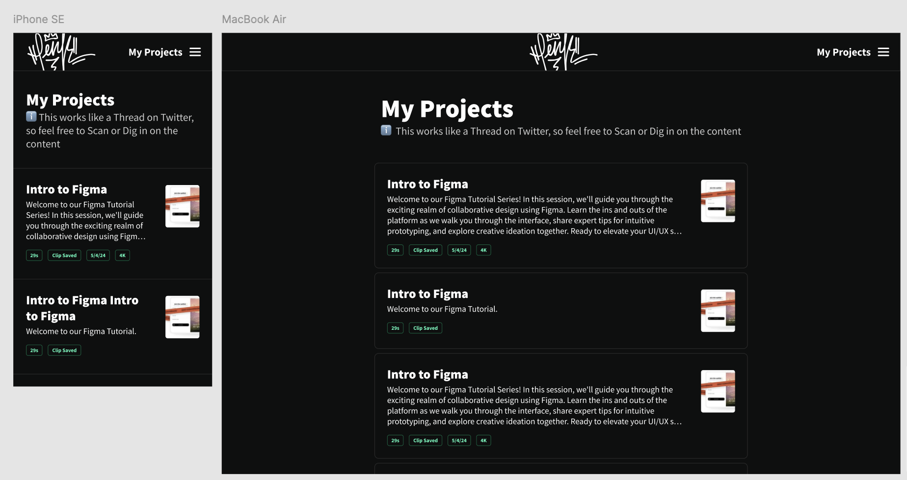
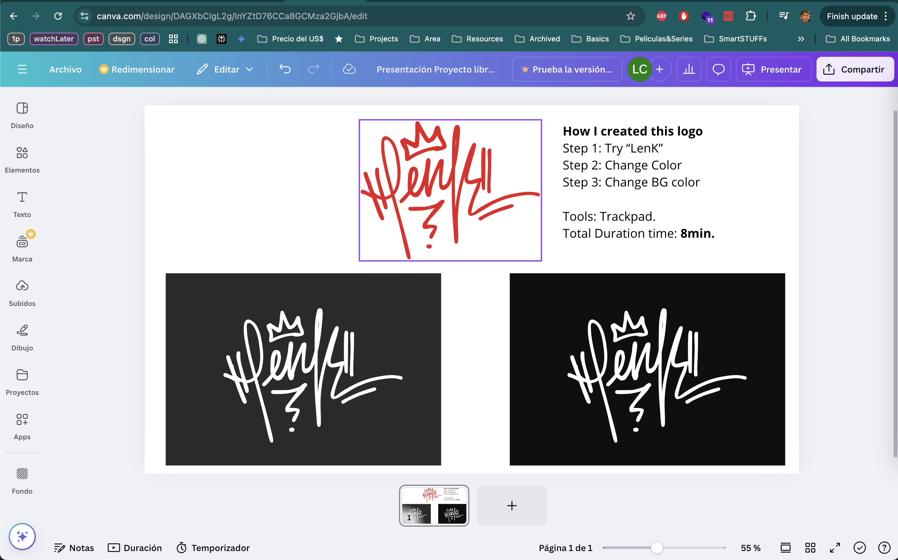

# Creation Process

1. Making a simple Design and layout for the foundation components.
2. Decision making on technologies that I want learn and apply for this project.
3. Learning those selected technologies meanwhile builting it.
   - Key tech: HTMX, maybe Sass (?)
4. CopyPasta my content from this.
5. After this is done, I'll use it as a Blogged/Portfolio starting with the last one.
6. Design-wise Blog/Portfolio is done, Switching to learn SASS, Def .scss is the way to go!
7. Going Sassy!

---

## My Learning Journey

1. Day 1. date_Nov-23-Sat-2024 - Setting GIT up and started to Design the layout on Figma
   - Of course I fought against Git using ChatGPT and won, ty Chat.
   - Figma Design using my old Design System Assets, changing some stuffs and taking references from Medium website.
     
2. Day 2. date_Nov-24-Sun-2024 - Learning the importance of SaSS
   - This one was an important to understand on if is necesary now or if I need it to skip it. FEELS FOUNDATIONS TO ME for ANY frontend after this research, so let's go.
   - Designed a Logo for myself, I took my own Sign as a logo, built it in Canva with ~7 minutes with my trackpad, replace the background color to added to the header and is done! Graffiti skills cames to the Rescue of my time ()
   - Closing the Design, is ready to go.
3. [Sass in 100 Seconds](https://youtube.com/watch?v=akDIJa0AP5c)
   - Great Overview of Sass
4. Day 3. date_Nov-25-Mon-2024 - Course of Sass

- Sass organization file looks pretty important, I need to learn that before to start my project.
- [Sass Essential Training](https://www.linkedin.com/learning/sass-essential-training-15630917/partials?autoSkip=true&resume=false)
- - I skipped a lot of this course just to get the basic, I don't think is a good course, thought (JUMPING)
- [Learn Sass In 20 Minutes | Sass Crash Course](https://www.youtube.com/watch?v=Zz6eOVaaelI)
- - This is kinda better, I could go back to this one, is kinda hard to apply stuff just from videos like this one that doesn't have a good project to teach you, but it works a lot. (DONE)

5. [SASS Tutorial (build your own CSS library) #2 - Compiling SASS](https://www.youtube.com/watch?v=Sk5jMurFHCo&list=PL4cUxeGkcC9jxJX7vojNVK-o8ubDZEcNb&index=2)

- This is in progress, I'm not planning to skipped right now, but who knows.
